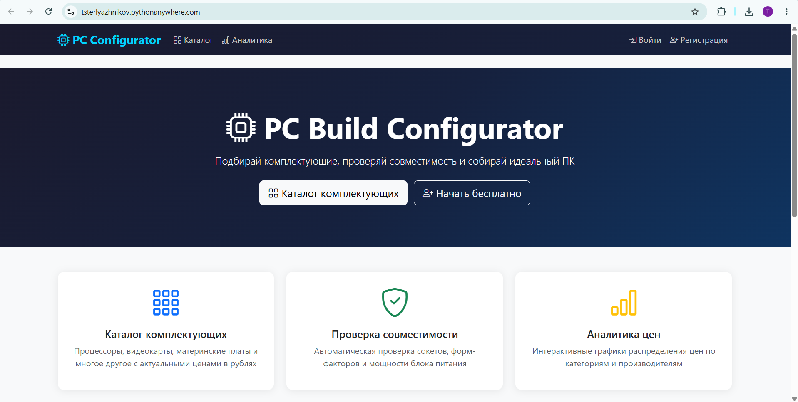
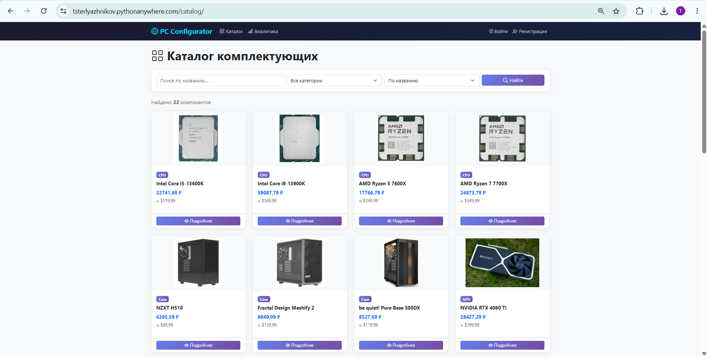
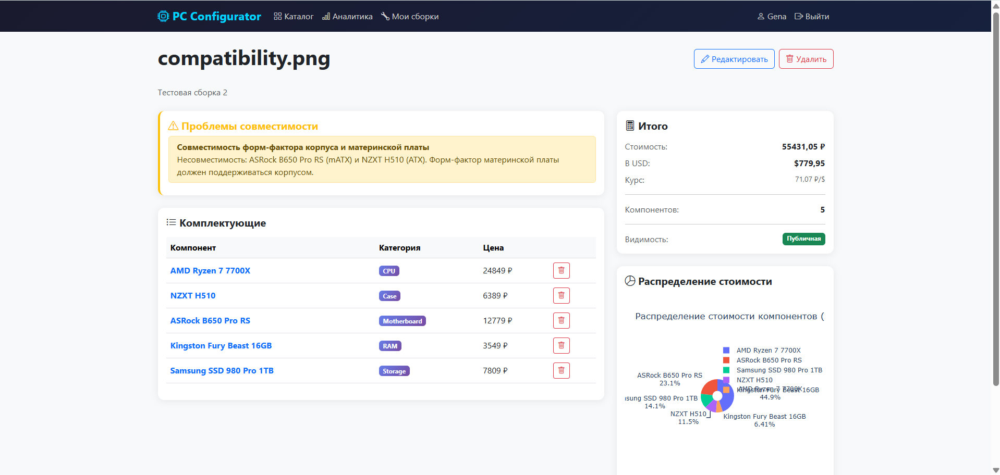
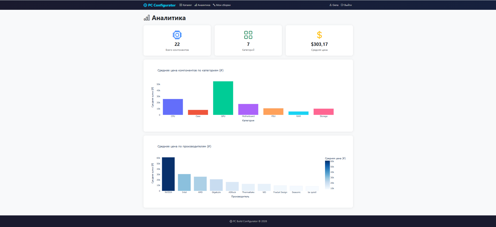

# PC Build Configurator

Веб-сервис для подбора и проверки совместимости комплектующих ПК. Помогает сборщикам автоматически проверять совместимость процессора и материнской платы, анализировать стоимость сборки с конвертацией цен в рубли через внешний API.

**Ссылка на рабочий проект:** https://tsterlyazhnikov.pythonanywhere.com

## Технологии
- **Python 3.13 / Django 6.0**
- **Plotly** — интерактивные графики аналитики
- **Pandas** — агрегация и анализ данных
- **ExchangeRate-API** — актуальный курс USD → RUB
- **Bootstrap 5** — адаптивный интерфейс

## Возможности
- Каталог комплектующих с фильтрацией по категории и сортировкой по цене
- Автоматическая проверка совместимости (сокет CPU/MB, форм-фактор корпуса)
- Конвертация цен USD → RUB через внешний API в реальном времени
- Личный кабинет с управлением сборками
- Публичные и приватные сборки
- Страница аналитики с интерактивными графиками Plotly

## Скриншоты

### Главная страница


### Каталог комплектующих


### Проверка совместимости


### Аналитика


## Установка и запуск

1. **Клонируйте репозиторий:**
```bash
   git clone https://github.com/tsterlaznikov-hub/pc-build-configurator.git
   cd pc-build-configurator
```

2. **Создайте виртуальное окружение:**
```bash
   python -m venv venv
   venv\Scripts\activate  # Windows
   source venv/bin/activate  # Linux/Mac
```

3. **Установите зависимости:**
```bash
   pip install -r requirements.txt
```

4. **Выполните миграции:**
```bash
   python manage.py migrate
```

5. **Заполните базу данных:**
```bash
   python manage.py populate_db
```

6. **Создайте суперпользователя:**
```bash
   python manage.py createsuperuser
```

7. **Запустите сервер:**
```bash
   python manage.py runserver
```

8. Откройте http://127.0.0.1:8000