# Техническое задание: PC Build Configurator

## 1. Цель проекта
Веб-сервис для сборщиков ПК, позволяющий подбирать комплектующие и автоматически проверять их совместимость. Система проверяет сокеты процессора и материнской платы, форм-факторы корпуса, отображает стоимость сборки в рублях через внешний API курсов валют.

## 2. Роли пользователей
| Роль | Возможности |
|---|---|
| Гость | Просмотр каталога, публичных сборок, аналитики |
| Пользователь | Создание/редактирование/удаление своих сборок, личный кабинет |
| Администратор | Полный доступ через Django Admin |

## 3. Модели данных

**Category** — категория комплектующих
- name, slug, description

**Component** — комплектующее
- name, category (FK), brand, price_usd, specs (JSON), image

**Build** — сборка пользователя
- name, user (FK), components (M2M), is_public, description

**CompatibilityRule** — правило совместимости
- name, category_a (FK), category_b (FK), spec_key, description

## 4. Ключевой функционал

- Каталог с фильтрацией по категории и сортировкой по цене
- Автоматическая проверка совместимости комплектующих в сборке
- Конвертация цен USD → RUB через ExchangeRate-API
- Личный кабинет с управлением сборками
- Страница аналитики с интерактивными графиками Plotly

## 5. Технический стек и интеграции

- **Backend:** Python 3.13, Django 6.0
- **База данных:** SQLite
- **Внешний API:** ExchangeRate-API (курс USD → RUB)
- **Аналитика:** Pandas, Plotly
- **Frontend:** Bootstrap 5

## 6. Изменения в ходе реализации
- Все цены переведены в рубли как основная валюта, USD отображается дополнительно
- Добавлены фотографии комплектующих

## 7. Схема данных и блок-схема работы сервиса

```mermaid
graph TD
    subgraph "Модели данных (ER)"
        Category[Category<br/>id, name, slug]
        Component[Component<br/>id, name, price_usd, specs]
        Build[Build<br/>id, name, is_public]
        User[User<br/>id, username, email]
        Rule[CompatibilityRule<br/>id, spec_key]
        
        Category -->|1:N| Component
        User -->|1:N| Build
        Build -->|M:N| Component
        Rule -->|N:1| Category
    end

    subgraph "Блок-схема работы"
        Start(Пользователь) --> Home[Главная]
        
        Home --> Catalog[Каталог]
        Home --> Analytics[Аналитика]
        Home --> Auth[Вход]
        
        Catalog --> Filter[Фильтр/поиск/сортировка]
        Filter --> ComponentPage[Страница компонента]
        ComponentPage -->|Конвертация| API[ExchangeRate-API]
        ComponentPage --> CheckAuth{Авторизован?}
        CheckAuth -->|Да| AddToBuild[Добавить в сборку]
        CheckAuth -->|Нет| Auth
        
        Analytics --> Pandas[Pandas агрегация]
        Pandas --> Plotly[Plotly графики]
        
        Auth --> Profile[Личный кабинет]
        Profile --> Builds[Мои сборки]
        Builds --> BuildDetail[Страница сборки]
        
        BuildDetail --> Total[Итоговая стоимость]
        BuildDetail --> Chart[Круговая диаграмма]
        BuildDetail --> Compatibility{Проверка совместимости}
        
        Compatibility -->|Сравнение spec_key| RuleCheck[CompatibilityRule]
        RuleCheck --> Warning[Вывод предупреждений]
    end

    style Category fill:#e1f5fe
    style Component fill:#e1f5fe
    style Build fill:#e1f5fe
    style User fill:#e1f5fe
    style Rule fill:#e1f5fe
    style API fill:#fff3e0
    style Pandas fill:#e8f5e9
    style Plotly fill:#e8f5e9
```

